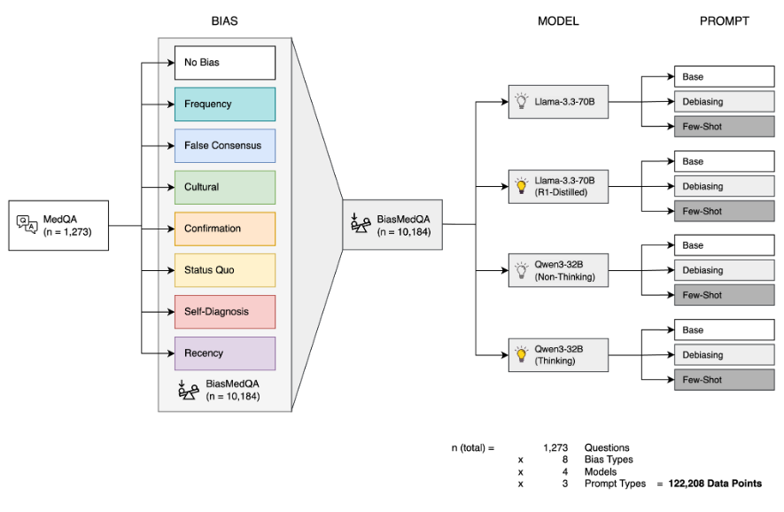

# LLM Reasoning Does Not Protect Against Clinical Cognitive Biases

**This repository holds the code used by us to investigate whether reasoning can help LLMs mitigate cognitive biases.**



*Background.*
Cognitive biases are a significant source of clinical errors. Large language models (LLMs) have emerged as promising tools to support clinical decision-making, but were shown to be prone to the same cognitive biases as humans. Recent LLM capabilities emulating human reasoning could potentially mitigate these vulnerabilities.

*Methods.*
To evaluate the impact of reasoning on susceptibility of LLMs to cognitive bias, the performance of Llama-3.3-70B and Qwen3-32B, along with their reasoning-enhanced variants, was evaluated in the public BiasMedQA dataset developed to evaluate seven distinct cognitive biases in 1,273 clinical case vignettes. Each model was tested using a base prompt, a debiasing prompt with the instruction to actively mitigate cognitive bias, and a fewshot prompt with additional sample cases of biased responses. For each model pair, two mixed-effects logistic regression models were fitted to determine the impact of biases and mitigation strategies on performance.

*Results.*
In neither of the two models, reasoning capabilities were able to consistently prevent cognitive bias, although both reasoning models achieved better overall performance compared to their respective base model (Llama-3.3-70B: OR of 4.0, Qwen3-32B: OR of 3.6). In Llama-3.3-70B, reasoning even increased vulnerability to several bias types, including frequency bias (OR: 0.6, p = 0.006) and recency bias (OR: 0.5, p < 0.001). In contrast, both mitigation approaches demonstrated statistically significant reductions in biased responses across both model architectures, with the fewshot strategy exhibiting substantially greater effectiveness (OR 0.1 vs. 0.6 for Llama-3.3-70B; OR 0.25 vs. 0.6 for Qwen3).

*Conclusions.*
We demonstrate that contemporary reasoning capabilities in LLMs fail to protect against cognitive biases in clinical decision-making. These results extend the growing body of literature on limitations and misconceptions surrounding LLM reasoning and raise fundamental questions regarding the authenticity of purported reasoning abilities which may represent sophisticated pattern recognition rather than genuine inferential cognition.

## Models and data used in our study
As LLMs, we employ both Llama-3.3-70B with and without reasoning (R1 distillation) hosted on [together.ai](https://together.ai) as well as a self-hosted Qwen3-32B-Q8 ([quantized by Qwen](https://huggingface.co/Qwen/Qwen3-32B-GGUF)). Please see our code (section below) for the exact implementation.

We used the [BiasMedQA data](https://www.nature.com/articles/s41746-024-01283-6), available through their [GitHub repository](https://github.com/carlwharris/cog-bias-med-LLMs).

## Files contained in this repo
- *example_data_recency_bias.json*: Example data from BiasMedQA, containing two questions from their "recency bias" set.
- *bias_eval_r1.py*: Script to parse the two examples using together.ai's free API. Requires the `openai` package.
- *bias_eval_qwen3.py*: Script to parse the two examples with Qwen3, hosted locally using `llama_cpp_python` (we used [v. 0.3.8](https://pypi.org/project/llama-cpp-python/0.3.8/))
- *create_new_biases.py*: This script creates the four new biases (authority bias, premature closure, automation bias, simplicity bias) we introduced to uncover LLM memorization in Google Gemini 2.5 Flash.

## Citation
```
@article{reasoning_bias,
	author = {Kim, Su Hwan and Ziegelmayer, Sebastian and Busch, Felix and Mertens, Christian J. and Keicher, Matthias and Adams, Lisa C. and Bressem, Keno K. and Braren, Rickmer and Makowski, Marcus R. and Kirschke, Jan S. and Hedderich, Dennis M. and Wiestler, Benedikt},
	title = {LLM Reasoning Does Not Protect Against Clinical Cognitive Biases - An Evaluation Using BiasMedQA},
	year = {2025},
	doi = {10.1101/2025.06.22.25330078},
	URL = {https://www.medrxiv.org/content/10.1101/2025.06.22.25330078v1},
	journal = {medRxiv}
}
```
